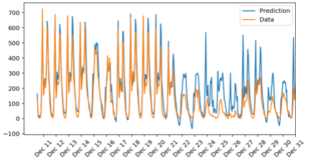

# Bike-sharing-Usage-Prediction-with-Neural-Network
Use a neural network to predict daily usage and capacity requirement for a bike sharing business

## Description
This project is part of Udacity's Deep Learning Nanodegree.

In this project, a neural network is trained to predict daily bike rental ridership.
The model is trained over two years of hourly data measuring bike usage.
The dataset provides information such as date, number of riders, day of the week, vacation vs no vacation period, various weather measures which can be used as relevant features during the training process.

## Network structure
The model uses a simple neural network built from scratch and located in the py file. It uses one simple MLP hidden layer.
It takes a feature vector with 56 features as input.
Limitations inherent to the architecture are discussed at the end of the project.

## Content
- Load and prepare data
- Build the network
- Train the network
- Check predictions (vs historical ground truth)

## Installation
- Download the repository
- Follow the guidelines in the nootebook to set your choosen hyperparameters

## Results

